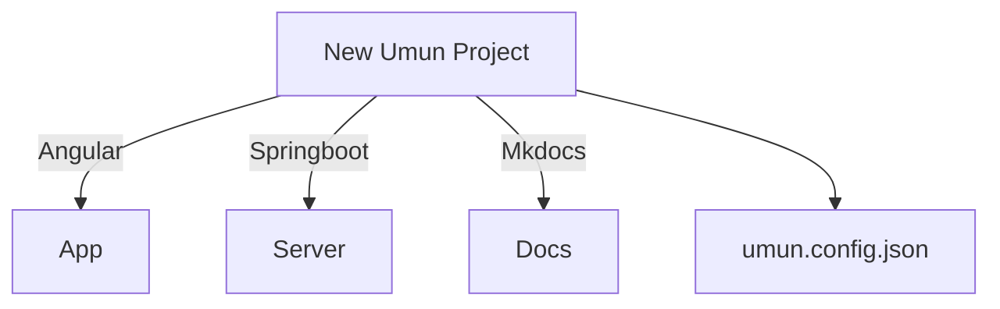

# Umun CLI

___

The Umun CLI is a command-line interface tool that you use to initialize, develop, scaffold, and maintain Umun Framework
applications directly from a command shell.

## Installing Umun CLI

---

### Prerequisites

* Install [Node.js](https://nodejs.org/) 14 or higher, which
  includes [Node Package Manager](https://www.npmjs.com/get-npm)

* Install [Java SDK v1.8](https://www.java.com/) or higher.

### Install

Major versions of Umun CLI follow the supported major version of Umun, but minor versions can be released separately.

Install the CLI using the npm package manager:

```
npm i -g @umun-tech/umun-cli
```

[Umun Framework](./../index.md) creates cross-platform full-stack apps at lightening fast speed.

## Basic Workflow

---

* Invoke the tool on the command line through the `umun` or `u` executable.

```
umun --help
umun --version
```

> You may invoke the above commands using `u --help` or `u --version` as well

To create, build, and serve a new, basic Umun project on a development server, go to the parent directory of your new
workspace use the following commands:

```bash
umun start project-umun
cd project-umun
umun serve
```

In your browser, open `http://localhost:4200/` to see the new application run. When you use the ng serve command to
build an application and serve it locally, the server automatically rebuilds the application and reloads the page when
you change any of the source files.

While your app is served on port 4200, Umun REST APIs are served on `http://localhost:8080/`


> When you run `umun start project-umun` a new folder, named project-umun, will be created in the current working directory. Since you want to be able to create files inside that folder, make sure you have sufficient rights in the current working directory before running the command. If the current working directory is not the right place for your project, you can change to a more appropriate directory by running `cd <path-to-other-directory>`.

## Workspace and Project Files

---

The `umun start` command creates a Umun workspace folder and generates a new project skeleton.


### Workspace
| Folder | Languages  | Framework                                                          | Description                                |
|--------|------------|--------------------------------------------------------------------|--------------------------------------------|
|  [App](./../framework/app/README.md)      | TypeScript | [Nx](https://nx.dev/getting-started/intro),  [Angular](angular.io) | Workspace for the front end application    |
|  [Server](./../framework/server/README.md)      | Java       | [SpringBoot](spring.io)                                            | Workspace for the back-end.                |
| [Docs](./../framework/docs/README.md)       | Markdown   | Mkdocs                                                             | Store documentation for your project here. |
|  [Config](./../framework/configuration/README.md)      | JSON       |                                                                    | Configuration of your umun project.        |

### Project configuration

A single workspace configuration file, `umun.config.json`, is created at the top level of the workspace. This is where you can set per-project defaults for CLI command options, and specify configurations to use when the CLI builds a project for different targets.

* See more about  [Project Configuration](./../framework/configuration/README.md)

---
## Command Overview

| Command                          | Alias | Description                                                                 |
|----------------------------------|-------|-----------------------------------------------------------------------------|
| [start](./start/README.md)       | s     | Creates a new Umun Project                                                  |
| [serve](./serve/README.md)       |       | Serves Umun Project on `https://localhost:4200` and `http://localhost:8080` |
| [add](./add/README.md)           |       | Adds Umun Modules to the Project.                                           |
| [generate](./generate/README.md) |       | Generates entities and other components.                                    |
| [build](./build/README.md)       |       | Builds the frontend and backend to required deployables.                    |
| [package](./build/README.md)       |       | Package the front end back end and all other dependencies in something like cubernetes.                    |
| [deploy](./build/README.md)       |       | Deploy the package to umun or external server                    |
| [commit](./build/README.md)       |       | Commits to our git solution or on github and others                    |


