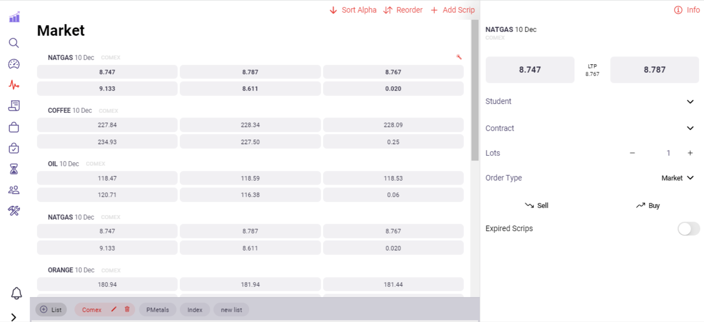
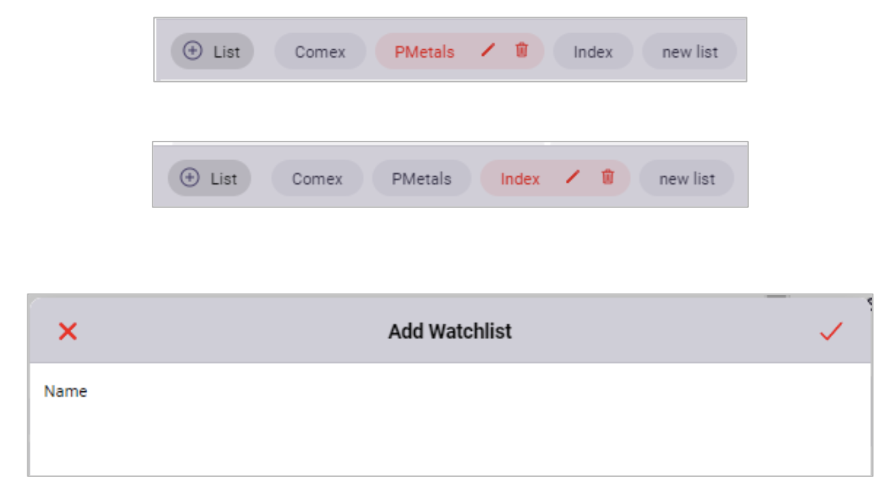
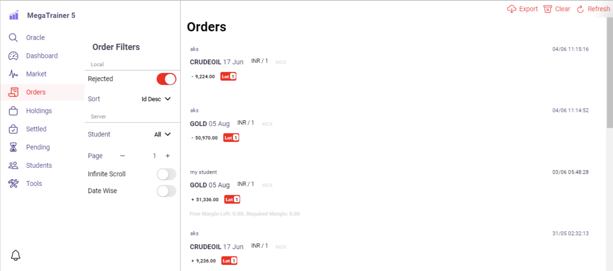
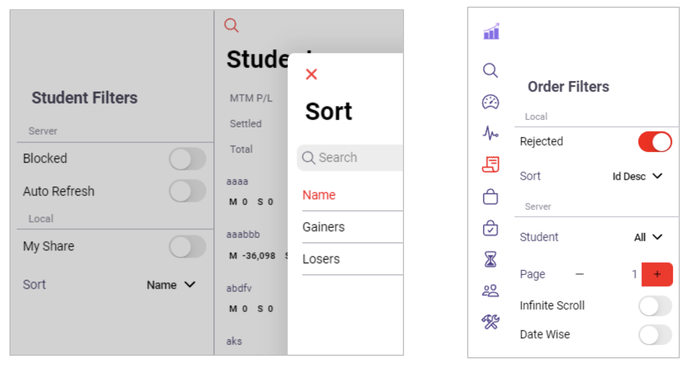
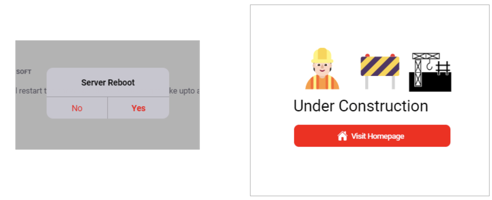

# Color codes and their elements

---

Analysis by [Prakrati Arya](https://www.instagram.com/illustrator_adobe_/) in June,2022.

To avoid confusion while theme building, I created have created this document in which I have put the screenshots of all the elements belonging to one particular colour code. 

Red colour is assigned to each colour code one by one depending upon which colour elements we are defining and the rest are kept white. For example, when defining the elements of primary color code, it will be kept red whereas the rest will be either whitish or greyish.

Let’s get started!

## Primary Color

At first, I have chosen  primary colour code which means it will be red and will help us identify all the elements that get affected when we alter the primary colour code.


```css
root {
    --ion-color-primary: _ #ff0000;
    --ion-color-primary-rgb: 255, 0, 0;
    -ion-color-primary-contrast: O #ffffff;
    -ion-color-primary-contrast-rgb: 255, 255, 255;
    -ion-color-primary-shade: #e00000;
    -ion-color-primary-tint: #fflala;
}
```

### Effect








---
